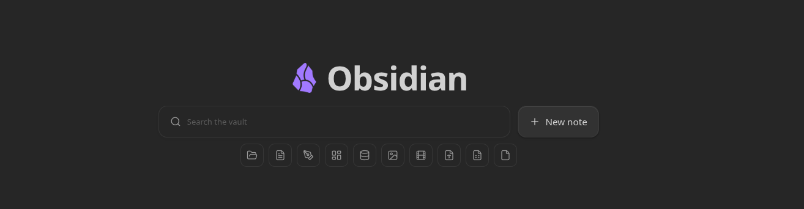
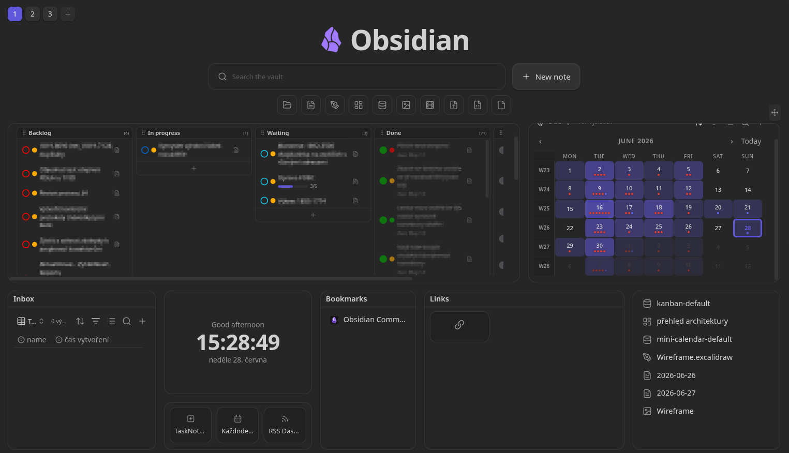
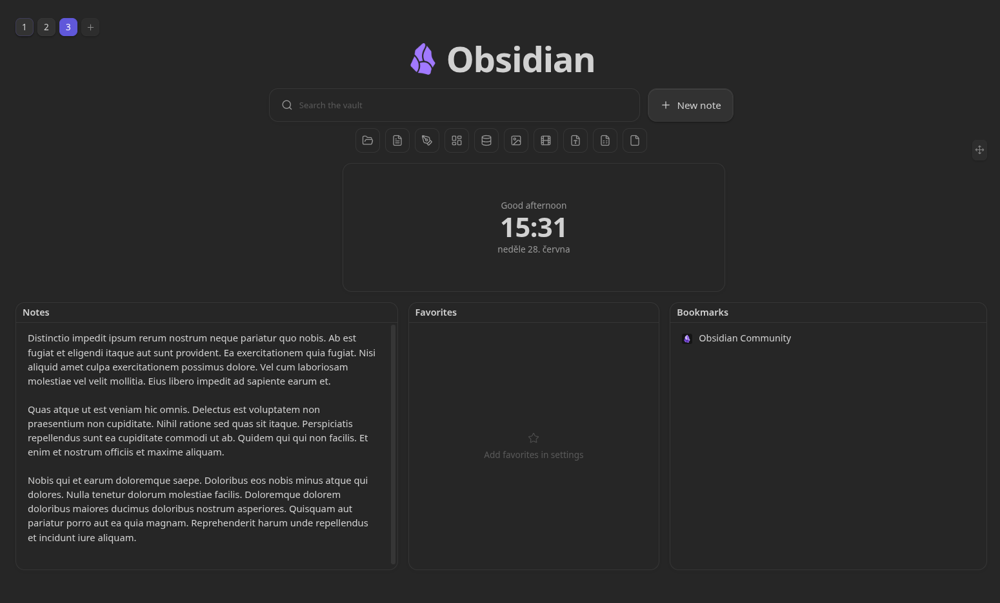
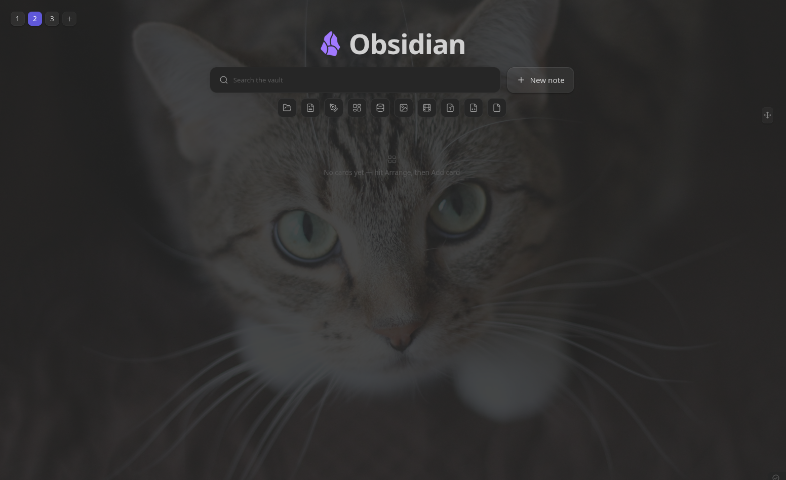
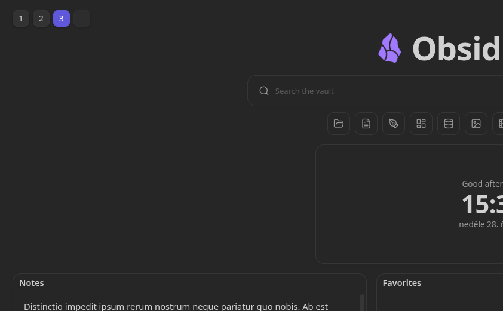
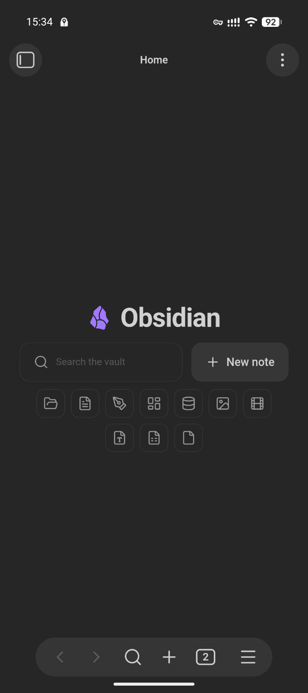

# Hearth



A beautiful, customizable **home screen for Obsidian** — search, dashboard, and
launcher in one. Hearth gives your vault a welcoming front page: a big search
field, quick file-type filters, a new-note button, and a grid of cards that
embed notes, images, bases, bookmarks and quick text.

[](https://ko-fi.com/B7K822EW68)

> Status: **v1.2** — the top section and a fully arrangeable card dashboard
> (free-form drag & resize with magnetic alignment, on-board card management, templates,
> per-card colors, web embeds, live auto-refreshing, zoomable and editable
> embeds, Excalidraw and canvas cards, multiple switchable dashboards with
> per-board overrides, pinned cards, a search-only mobile mode with a
> customizable action bar, tag/frontmatter/full-text search, command mode,
> Tasks/calendar/stats/saved-search/heatmap cards, Kanban tasks, layout
> import/export) are in. See [Roadmap](#roadmap) for what's next.

## Screenshots















## Features

### Top section
- **Customizable title / logo** — set any title text and an emoji/short logo.
- **Vault search** — fuzzy search across your whole vault (the `.obsidian`
  config folder is ignored automatically). Keyboard friendly: `↑`/`↓` to move,
  `Enter` to open, `Esc` to dismiss. A leading `#` switches to **tag search**;
  `key:value` (or bare `key:`) switches to **frontmatter property search**; a
  leading `>` switches to **command mode** (run any command) — all distinct,
  transparent modes that show exactly what matched. With **Search note
  contents** on (default), plain queries also match note *bodies* and show a
  snippet. Matched characters are highlighted. An empty, focused search field
  quietly offers your recently opened files.
- **Auto-detected filters** — file-type filter chips are generated from what
  actually lives in your vault, grouped sensibly (Notes, Images, Videos,
  Sheets, Slides, Documents, Folders, Canvas, Bases…), each with a fitting
  icon. Hide any you don't want in settings.
- **New note button** — creates a note in your configured default location.
- **Optional background** — solid color, a vault image, or an image URL, with
  opacity and blur controls.

### Dashboard cards
- **Embed** — embed a note (`.md`), image, canvas, or `.base` file. Rendered
  through Obsidian's own renderer, so anything Obsidian (or the Bases plugin)
  can embed, a card can show. Each embed has a **zoom** control to scale its
  content up or down to fit the card. Markdown notes can be made **editable** —
  shown rendered and switching to a raw editor on double-click, saving straight
  back to the vault.
- **Excalidraw & canvas cards** — dedicated templates for embedding an
  Excalidraw drawing or a `.canvas` file, with a friendly prompt when the
  required plugin isn't enabled. Both fill the card edge-to-edge so their own
  native pan/zoom (and Excalidraw's in-place edit toggle) work like they do in
  a regular note.
- **Tasks** — scans Markdown checkboxes across whitelisted/blacklisted
  folders (with 📅 due-date parsing, click-to-toggle, click-to-open at the
  line), or reads TaskNotes' task notes via frontmatter (field names
  configurable in settings, since TaskNotes has no public API).
- **Mini calendar** — a month grid resolved from the core Daily notes
  plugin's format/folder, with a dot on days that already have a note.
- **Vault statistics** — notes, attachments, folders, unique tags and your
  daily-note streak, read entirely from the in-memory vault index.
- **Saved search** — a card that runs a stored query (the same syntax as the
  search bar) and lists the matching files, refreshed live.
- **Activity heatmap** — a GitHub-style contribution grid tinted by how many
  notes were edited (or created) each day.
- **Kanban tasks** — the Tasks card can render as a Kanban board grouped by
  status; drag cards between columns to change checkbox state or TaskNotes
  status, drag column headers to reorder them, and hide columns you don't need.
  TaskNotes tasks also show a **priority indicator** read from a configurable
  frontmatter field.
- **Daily note** — always shows *today's* daily note (resolved from the core
  Daily notes plugin's date format and folder), with a one-click prompt to
  create it when it doesn't exist yet and a hideable button to open it in the
  editor. Optionally editable in place.
- **Web page** — embed any `http(s)` URL in a sandboxed iframe.
- **Live content** — embed and daily cards update automatically the moment
  their file is created, edited or deleted; web cards can auto-refresh on an
  interval.
- **Bookmarks** — pulls from Obsidian's core Bookmarks plugin.
- **Favorites** — a grid of curated note cards.
- **Recent files** — your recently opened files (configurable count).
- **Links / launchpad** — a grid of tiles opening notes, URLs or commands.
- **Commands** — tiles that run any command-palette command, with an adjustable
  **button size**.
- **Clock & greeting** — digital or **analogue** face, several date formats
  (including a custom moment.js format), and a live greeting with an optional
  **playful** (cheeky, randomised) mode.
- **Text / jot-down** — a quick scratch field saved with the card, rendered as
  **Markdown** (double-click to edit).

### Multiple dashboards
- **Switcher** — a `[1] [2] [+]` row in the top-left switches between boards and
  adds new ones. Give a board an **emoji/icon** to label its button instead of a
  number. Right-click a button for **dashboard settings** (name, icon,
  overrides) or to **delete** it.
- **Per-dashboard overrides** — each board can override the global **content
  width** and **background**, or fall back to the defaults.
- **Pinned cards** — pin any card to show it on *every* dashboard, sharing one
  definition and position across boards.
- **Keyboard shortcuts** — commands to jump to a dashboard by position
  (*Switch to dashboard 1…9*) and to move to the **next/previous** dashboard.
  Bind them under **Settings → Hotkeys** (e.g. `Ctrl/Cmd+1`).

### Arranging the dashboard
- **Drag & resize** — hit **Arrange** to move cards (drag anywhere) and resize
  them from **any edge or corner**. Placement is fully free-form (no grid): cards
  can sit and be sized anywhere, with **magnetic alignment** — edges and centres
  snap to neighbouring cards and the board, showing guide lines, so layouts stay
  clean.
- **On-board management** — in arrange mode each card header is editable:
  rename inline, swap the embedded file via a fuzzy picker, or remove the card.
  **Add card** (toolbar) drops in a new card from the library.
- **Per-card colors** — give any card an accent and a background tint.
- **Granular sizing** — numeric width/height per card, plus a configurable row
  height so cards can be sized finely.
- **Import / export** — back up or share the active board's layout as JSON.
- The dashboard can either scroll or be locked to a single page.

### Mobile
- **Mobile mode** — an optional search-only launcher: on phones and tablets the
  dashboard collapses to just the search field (desktop is unaffected).
- **Mobile action bar** — in Mobile mode, the “New note” button moves out from
  beside the search bar into a row of buttons under the search field and
  filters, pinned to the bottom quarter of the screen. Ships with **New
  note**, **New drawing** (Excalidraw), **Record voice** (core Audio
  recorder) and **Open daily note**, but every button can be swapped for any
  command from the same picker used by the Commands card.

## Usage
- Hearth opens automatically on startup and replaces empty new tabs (both
  toggleable in settings).
- Open it any time from the ribbon **home** icon or the command
  **“Open home dashboard”**.
- Configure everything under **Settings → Hearth**.

## Development

```bash
npm install      # install dependencies
npm run dev      # watch build -> main.js
npm run build    # typecheck + production build
```

To test in a vault, symlink or copy `main.js`, `manifest.json` and `styles.css`
into `<vault>/.obsidian/plugins/hearth/`.

## Roadmap
- [x] **Continuous free-form layout** — cards are placed and sized freely
  (no fixed columns or row height) with smooth dragging and **magnetic
  alignment** to neighbouring cards and the board, guide lines included
- [x] Drag & resize cards on a free-form grid (custom lightweight engine)
- [x] More card types (recent, links/launchpad, commands, clock)
- [x] Per-card backgrounds and accent colors
- [x] Card library / templates
- [x] Best-effort Bases (`.base`) embedding (depends on the core Bases plugin)
- [x] **Manage embeds from the dashboard** — add, remove, swap embedded files
  and rename cards directly on the board, fully driven by the user
- [x] **Filter click expands a match menu** — clicking a search filter drops
  down the matching items immediately
- [x] **Excalidraw filter** — dedicated file-type filter for Excalidraw drawings
- [x] **"Other" filter** — catch-all for every file not matched by any other
  filter
- [x] Collision-aware auto-packing while dragging
- [x] Inline web/iframe embeds
- [x] Import/export dashboard layouts
- [x] **Configure cards on the board** — every per-card setting (type, title,
  content, colors and size) is edited from the card itself in arrange mode, not
  in the settings tab
- [x] **More granular card sizing** — numeric width & height inputs per card
- [x] **Customizable clock** — 24-hour time, seconds, greeting toggle/override
  and date display mode
- [x] **`.usheet` (Univer Sheet) support** — recognized as spreadsheets in the
  file-type filters
- [x] **Compact spacing** — toggle to tighten card padding and the top margin
- [x] **Bookmark favicons** — show site favicons next to URL bookmarks
- [x] **Real app icon** — used for the ribbon, tab and header logo (shipped in
  the bundle)
- [x] **Commands card** — tiles that run chosen command-palette commands
- [x] **Mobile search** — results float as an overlay so they no longer push
  the dashboard off-screen on phones
- [x] **Live cards** — per-card auto-refresh interval for embed and web cards
- [x] **Embed zoom** — per-card scale control for embedded content
- [x] **Editable `.md` embeds** — a per-card toggle to edit an embedded note in
  place; edits save straight back to the vault
- [x] **Excalidraw drawing card** — dedicated card template for embedding an
  Excalidraw drawing, with a prompt to install the plugin when it's missing
- [x] **Canvas card** — dedicated card template for embedding a `.canvas` file,
  with a prompt to enable the core Canvas plugin when it's off
- [x] **Multiple dashboards** — several switchable boards, managed from the
  `[1] [2] [+]` switcher in the top-left (right-click a button for settings or
  delete)
- [x] **Per-dashboard overrides** — columns, row height and background can be set
  per board, falling back to the global defaults
- [x] **Per-dashboard icon** — an emoji/short text on the switcher button instead
  of a number
- [x] **Pinned cards** — show a card on every dashboard, shared across boards
- [x] **Dashboard keyboard shortcuts** — switch to a board by position, or
  next/previous (bindable in Settings → Hotkeys)
- [x] **Mobile mode** — an option to collapse to just the search field on phones
  and tablets, leaving the dashboard for desktop
- [x] **Granular row height** — a Row height setting for finer control over how
  tall cards can be
- [x] **Command tile size** — adjustable button size on the commands card
- [x] **Daily note card** — always embeds today's daily note, with a prompt to
  create it when missing
- [x] **Live embeds** — embed and daily cards refresh from vault events the
  moment their file changes; editable notes sync without ever losing the cursor
- [x] **Reorder list items** — move links, command tiles and favorites up/down
  from the card's settings
- [x] **Live-mode editable embeds** — rendered Markdown by default, double-click
  to edit the raw note
- [x] **Open-note button** — a hideable button on the daily-note card
- [x] **Analogue clock & richer dates** — analogue face, more date formats
  (incl. custom), and optional playful greetings
- [x] **Mobile action bar** — a customizable row of buttons (New note, New
  drawing, Record voice, Open daily note by default) pinned to the bottom
  quarter of the screen in Mobile mode, each button replaceable with any
  command
- [x] **Interactive Excalidraw/canvas cards** — embeds fill the card so native
  pan/zoom and in-place editing work like they do in a regular note
- [x] **Tag search** — a leading `#` searches vault tags instead of names,
  showing which tag matched
- [x] **Frontmatter property search** — `key:value` (or bare `key:`) searches
  frontmatter properties directly
- [x] **Recent-files search history** — a focused, empty search field quietly
  offers recently opened files
- [x] **Tasks card** — Markdown checkboxes or TaskNotes frontmatter, with
  folder whitelist/blacklist
- [x] **Mini calendar card** — a month grid of daily notes
- [x] **Vault statistics card** — notes/attachments/folders/tags counts and a
  daily-note streak
- [x] **Full-text search** — an optional toggle to also match note *bodies*,
  not just names/tags/properties, with a snippet showing what matched
- [x] **Command mode** — a leading `>` in the search bar runs any command
- [x] **Match highlighting** — matched characters are highlighted in results
- [x] **Saved-search card** — a card that lists the results of a stored query
- [x] **Activity heatmap card** — a GitHub-style contribution grid of edits
- [x] **Kanban tasks** — a per-card Kanban layout that groups tasks into status
  columns and lets you drag them between (writes checkbox state / TaskNotes
  status back to the file)
- [x] **Calendar week numbers & heatmap** — optional ISO week column and an
  edit-count tint; clicking an empty day creates that day's note
- [x] **Per-command tile size** — size command tiles individually
- [x] **Reorder dashboards** — drag the switcher buttons to reorder boards
- [x] **Per-board fit-to-page / max-width overrides**
- [x] **Web framing fallback** — an "open in browser" button and a message when
  a site refuses to be embedded
- [x] **Accessibility** — result list, filter chips, cards, calendar days and
  switcher buttons are keyboard-operable with proper roles

### Planned

Bigger ideas
- [ ] Drag tasks between days on the calendar

## License
MIT © ondreu
