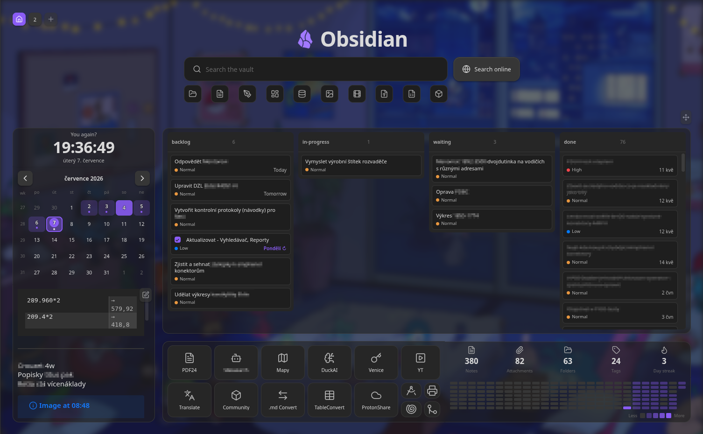
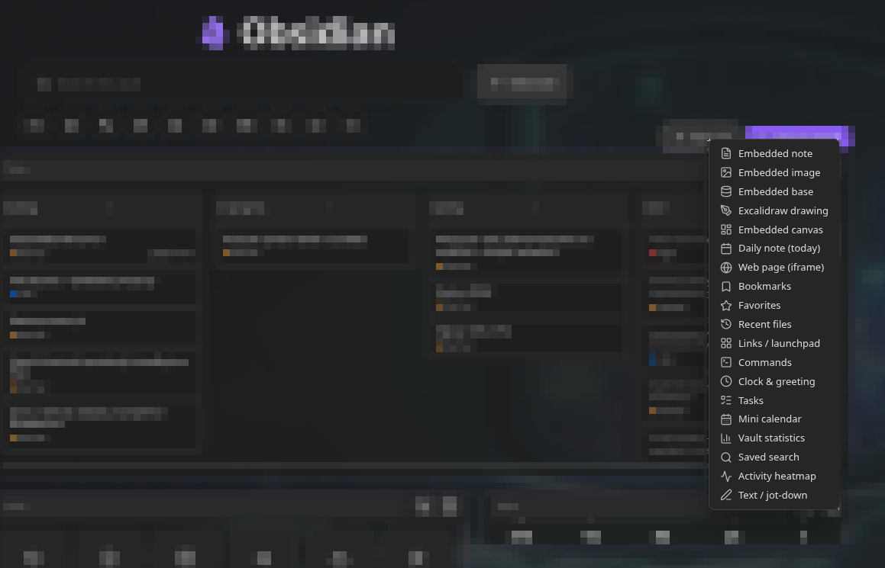

# Hearth


A beautiful, customizable **home screen for Obsidian** — search, dashboard, and
launcher in one. Hearth turns your vault into a welcoming front page with a fast
fuzzy search, quick file-type filters, and a fully arrangeable grid of live
cards: embeds, web pages, tasks, calendars, stats, clocks, launchpads and more.

## Screenshots






---

## Table of contents

- [Quick start](#quick-start)
- [Search & filters](#search--filters)
- [Dashboard cards](#dashboard-cards)
- [Multiple dashboards](#multiple-dashboards)
- [Arranging the dashboard](#arranging-the-dashboard)
- [Appearance](#appearance)
- [Mobile](#mobile)
- [Settings](#settings)
- [Keyboard shortcuts](#keyboard-shortcuts)
- [Development](#development)
- [Roadmap](#roadmap)
- [License](#license)

## Quick start

1. Install Hearth from Obsidian's community plugin browser (or drop
   `main.js`, `manifest.json` and `styles.css` into
   `<vault>/.obsidian/plugins/hearth/` and enable it).
2. Hearth opens automatically on startup and replaces empty new tabs — both
   toggleable in **Settings → Hearth**.
3. Open it any time from the ribbon **home** icon or the
   **“Open home dashboard”** command.
4. Hit **Arrange** (top-right) to add, move, resize and configure cards
   directly on the board.

## Search & filters

The search field at the top is your vault's command centre — keyboard-first,
with three transparent modes:

| Prefix | Mode | What it matches |
| --- | --- | --- |
| *(none)* | Fuzzy search | File names, tags, properties, and (optionally) note bodies |
| `#` | Tag search | Vault tags, showing which tag matched |
| `key:value` or `key:` | Frontmatter search | Notes whose property matches |
| `>` | Command mode | Any registered command, run by name |

- **Full-text** matching is on by default — plain queries also match note
  *bodies* and show a snippet of what matched. Matched characters are
  highlighted throughout.
- **Recent files** — a focused, empty search field quietly offers your
  recently opened files.
- **Auto-detected filters** — file-type chips generated from what actually
  lives in your vault (Notes, Images, Videos, Sheets, Slides, Documents,
  Folders, Canvas, Bases, Excalidraw…), each with a fitting icon. Click a
  filter to drop down its matching items; hide any you don't want in settings.
- **New note button** — creates a note in your configured default location.
- **Omnisearch engine** *(optional)* — the search bar uses Hearth's built-in
  engine by default, but you can switch it to
  [Omnisearch](https://github.com/scambier/obsidian-omnisearch) in
  **Settings → Appearance → Search engine**. When selected, plain queries are
  routed through the installed Omnisearch plugin (its results, ranking and
  snippets), while `>` command mode and the file-type filters keep working. If
  Omnisearch isn't installed or enabled, Hearth prompts you to install it and
  stays on the built-in engine.

## Dashboard cards

Cards are the building blocks of the dashboard. Add them from the **Arrange**
toolbar; configure each one from the card itself (title, content, colors, size).

- **Embed** — embed a note (`.md`), image, canvas, or `.base` file, rendered
  through Obsidian's own renderer. A per-card **zoom** control scales content to
  fit. Markdown notes can be made **editable** — rendered by default, switch to a
  raw editor on double-click, saving straight back to the vault.
- **Excalidraw & canvas** — dedicated templates for an Excalidraw drawing or a
  `.canvas` file, filling the card edge-to-edge so native pan/zoom (and
  Excalidraw's in-place edit toggle) work like they do in a regular note.
  Includes a friendly prompt when the required plugin isn't enabled.
- **Daily note** — always shows *today's* daily note (resolved from the core
  Daily notes plugin's date format and folder), with a one-click prompt to
  create it when missing and a hideable button to open it in the editor.
  Optionally editable in place.
- **Web page** — embed any `http(s)` URL in a sandboxed iframe, with an
  optional auto-refresh interval and an "open in browser" fallback for sites
  that refuse to be framed.
- **Tasks** — scans Markdown checkboxes (with 📅 due-date parsing,
  click-to-toggle, click-to-open at the line), reads TaskNotes task notes via
  frontmatter, or reads a [Kanban](https://github.com/obsidian-community/obsidian-kanban)
  plugin board note. Folder whitelist/blacklist for scope. Click **+** (top-right,
  TaskNotes source) to create a new task via TaskNotes' own command. Tasks are
  sorted by **due → scheduled → priority → created**. Due dates show as short
  relative labels (**Today**, **Tomorrow**, **Yesterday**, the weekday for the
  rest of the week, **Next Friday** / **Last Friday** for the week after, then
  a compact "15 Jul"). They also accept **natural-language input**: write
  `📅 tomorrow`, `📅 next friday`, `📅 in 3 days`, `📅 end of month` (or the same
  wording in a TaskNotes `due` field) and Hearth resolves it to a date.
- **Recurring tasks** — TaskNotes tasks with a `recurrence` RRULE show a **↻**
  badge next to the next-occurrence date (read from `scheduled`), tinted with
  the accent color so recurring items stand out at a glance. Hovering the date
  reveals a plain-English schedule (e.g. "Repeats every week"). Overdue
  recurring tasks are tinted just like one-offs.
- **Kanban tasks** — the Tasks card can render as a Kanban board grouped by
  status. Drag cards between columns to change checkbox state or TaskNotes
  status, drag column headers to reorder, and hide columns you don't need.
  TaskNotes tasks show a **priority indicator** read from a configurable
  frontmatter field, and a drop outline previews where a dragged card will
  land.
- **Kanban plugin board** — point the Tasks card at a
  [Kanban](https://github.com/obsidian-community/obsidian-kanban) board note
  (or let Hearth auto-detect one by its `kanban-plugin` frontmatter). Each `##`
  heading becomes a column and the checkbox items beneath it become cards.
  Read it either as a **list** or as Hearth's own **Kanban board**: drag cards
  between the board's real columns (Hearth rewrites the note, moving the item
  under the target heading), tick a card to complete it in place, and add new
  cards straight into a column. Card text renders **`[[wikilinks]]` and
  Markdown links** as clickable links. **Right-click a card** (on the board or
  in the list) to **edit its due date & priority**, **convert it into its own
  note** (like the Kanban plugin — the card becomes a link), or **delete** it.
  A column's **check icon** marks it a *done column*, so cards complete
  automatically when dragged or added there (and the ones already in it
  complete at once). Turn on **Tasks-plugin metadata** to parse the
  [obsidian-tasks](https://github.com/obsidian-tasks-group/obsidian-tasks)
  emoji fields on each card — priority (🔺⏫🔼🔽⏬), recurrence (🔁), and the
  start (🛫), scheduled (⏳), due (📅) and done (✅) dates — shown as compact
  indicators on the card (priority as a coloured dot on board cards, a labelled
  chip in the list) and used for sorting. Both the **add-card form** and the
  right-click **task-metadata editor** provide fields for priority, recurrence
  and the start/scheduled/due dates, written back as those markers; checking a
  card off stamps its ✅ done date (and unchecking removes it). Leave the mode
  off to read the board as-is.
  Everything is written back in Kanban's own format, so the board stays fully
  editable in the Kanban plugin.
- **Mini calendar** — a month grid resolved from the core Daily notes plugin's
  format/folder, with a dot on days that already have a note. Optional ISO week
  numbers and an edit-count heatmap tint; click an empty day to create that
  day's note.
- **Vault statistics** — notes, attachments, folders, unique tags and your
  daily-note streak, read entirely from the in-memory vault index.
- **Saved search** — runs a stored query (the same syntax as the search bar) and
  lists the matching files, refreshed live.
- **Activity heatmap** — a GitHub-style contribution grid tinted by how many
  notes were edited (or created) each day.
- **Bookmarks** — pulls from Obsidian's core Bookmarks plugin, with site
  favicons next to URL bookmarks.
- **Favorites** — a grid of curated note cards.
- **Recent files** — your recently opened files (configurable count).
- **Links / launchpad** — a grid of tiles opening notes, URLs or commands.
  Tiles live on a **CSS grid** with independent **column and row spans**, so a
  tile can be 2×2, 4×1, or any proportion. In arrange mode, drag a tile to
  **drop it anywhere** on the card — it pins to that spot instead of being
  forced into a top-to-bottom, left-to-right flow (double-click a pinned tile
  to release it back to auto-flow), and resize each tile independently via a
  corner grip.
- **Commands** — tiles that run any command-palette command, on the same grid
  with adjustable per-tile size.
- **Clock & greeting** — digital or **analogue** face, several date formats
  (including a custom moment.js format), and a live greeting with an optional
  **playful** (cheeky, randomised) mode.
- **Text / jot-down** — a quick scratch field saved with the card, rendered as
  Markdown (double-click to edit).
- **Calculator** — a Wolfram-Alpha-style input box that evaluates as you type:
  arithmetic and math functions (`sqrt`, `sin`, `log`, `5!`, `2^10`…), **unit
  conversions** across length, mass, temperature, time, volume, area, speed and
  data (`10 km to miles`, `100 f in c`, `1 gb to mb`), **currency** conversions
  using live ECB rates (`10 € to USD`, `$5 in czk`), and **plain-language**
  queries (`20% of 150`, `5 squared`, `3 x 4`). An optional on-screen **keypad**
  (basic or scientific, chosen in card settings) is handy on mobile. Everything
  except currency is computed locally; exchange rates are fetched once and
  cached, and currency degrades gracefully offline.

### Live content

- Embed and daily cards refresh from vault events the moment their file changes
  (created, edited, deleted); editable notes sync without ever losing the
  cursor.
- Web cards can auto-refresh on an interval.
- Data-driven cards (tasks, stats, calendar, search, heatmap) redraw on vault
  and metadata changes.

## Multiple dashboards

- **Switcher** — a `[1] [2] [+]` row in the top-left switches between boards and
  adds new ones. Give a board an **emoji/icon** to label its button instead of a
  number. Right-click a button for **dashboard settings** (name, icon,
  overrides) or to **delete** it. Drag the buttons to reorder boards.
- **Per-dashboard overrides** — each board can override the global **content
  width**, **fit-to-page**, **columns**, **row height** and **background**,
  falling back to the defaults when unset.
- **Pinned cards** — pin any card to show it on *every* dashboard, sharing one
  definition and position across boards.

## Arranging the dashboard

- **Free-form drag & resize** — hit **Arrange** (top-right) to move cards (drag
  anywhere) and resize them from **any edge or corner**. Placement is fully
  free-form: cards sit and size anywhere, with **magnetic alignment** — edges
  and centres snap to neighbouring cards and the board, showing guide lines.
- **Edge-merging cards** — when two cards are snapped together (touching edges),
  their shared border drops out and the touching corners sharpen so the pair
  reads as **one continuous tile** — like grouped Android notifications. The
  merge follows the live layout, so it updates as you drag cards together.
- **On-board management** — in arrange mode each card header is editable:
  rename inline, swap the embedded file via a fuzzy picker, or remove the card.
  **Add card** (toolbar) drops in a new card from the library. A **Hide header**
  toggle in the toolbar hides the dashboard header so the full board is visible
  end-to-end while you arrange.
- **Per-card colors & background** — give any card an accent and a background
  tint.
- **Per-card opacity** — a global **Card opacity** slider tints card surfaces
  so the dashboard background shows through without dimming content. Opacity
  cascades: global → per-dashboard → per-card override.
- **Ambient default background** — out of the box Hearth ships with a soft
  ambient background (low opacity + blur) that sits behind cards without
  competing with content. Replace it with a solid color, a vault image, or an
  image URL — per-board overrides supported.
- **Independent tile sizing** — tiles live on a fine CSS grid (44 px cells,
  4 px snap), each with its own column and row span. Drag the corner grip to
  resize; drag the tile body to **drop it anywhere on the card** (it pins to
  that spot; double-click to release it back to auto-flow). The default tile
  is a 2×2 cell block.
- **Granular card sizing** — numeric width/height per card, plus a configurable
  row height for fine vertical control.
- **Fit to page** — lock the dashboard to one screen (no scroll) or let it
  scroll. Available globally and per-board. On by default for new installs;
  stuck cards are auto-recovered back onto the board on render.
- **Import / export** — back up or share the active board's layout as JSON.

## Appearance

- **Title & logo** — set any title text and an emoji/short logo.
- **Background** — solid color, a vault image, or an image URL, with opacity
  and blur controls. Per-board overrides supported. Ships with an ambient
  default so the dashboard looks good out of the box.
- **Compact spacing** — tighten card padding and the top margin to enlarge the
  usable area.
- **Card opacity** — make card surfaces translucent so the dashboard background
  shows through; content stays fully legible.

## Mobile

- **Mobile mode** — an optional search-only launcher: on phones and tablets the
  dashboard collapses to just the search field (desktop is unaffected).
- **Mobile action bar** — in Mobile mode, the “New note” button moves out from
  beside the search bar into a row of buttons under the search field and
  filters, pinned to the bottom quarter of the screen. Ships with **New note**,
  **New drawing** (Excalidraw), **Record voice** (core Audio recorder) and
  **Open daily note**, but every button can be swapped for any command from the
  same picker used by the Commands card.
- **Keyboard-aware** — when the on-screen keyboard opens, the visible area is
  tracked so nothing hides behind it.

## Settings

Everything lives under **Settings → Hearth**:

- **Header** — title, logo, search placeholder, new-note button, full-text
  search.
- **Background** — kind (none/color/image/URL), opacity, blur.
- **Behaviour** — open on startup, replace empty new tabs, mobile search-only,
  mobile action bar.
- **Dashboard** — fit to page, compact spacing, card opacity, columns, row
  height, max width.
- **Tasks / TaskNotes** — frontmatter field names and the status value that
  counts as "done".
- **Layout import / export** — back up or share the current dashboard as JSON.

Per-card settings (type, title, content, colors, size) are edited from the card
itself in arrange mode — not from the settings tab.

## Keyboard shortcuts

Hearth registers commands you can bind under **Settings → Hotkeys**:

- **Open home dashboard**
- **Switch to dashboard 1…9**
- **Switch to next / previous dashboard**

In the search field: `↑`/`↓` to move, `Enter` to open, `Esc` to dismiss.

## Development

```bash
npm install      # install dependencies
npm run dev      # watch build -> main.js
npm run build    # typecheck + production build
npm run typecheck
```

To test in a vault, symlink or copy `main.js`, `manifest.json` and `styles.css`
into `<vault>/.obsidian/plugins/hearth/`.

### Translations

User-facing strings live in [`src/locales/`](src/locales/). English
(`en.ts`) is the source of truth and Hearth follows Obsidian's UI language at
load. Adding a language is a matter of copying `en.ts`, translating the values
(the keys are type-checked against English), and registering the file — see
[`src/locales/README.md`](src/locales/README.md) for the walkthrough.

## Shipped:

> **v1.6.8.6-beta** — fuller obsidian-tasks metadata on Kanban cards: start
> (🛫), scheduled (⏳) and done (✅) dates alongside due, a 5-level priority
> (🔺⏫🔼🔽⏬) and recurrence (🔁). The add-card form and a new right-click
> **task-metadata editor** provide input fields for all of them, cards show
> compact date/priority **indicators**, and checking a card off stamps its ✅
> done date.

> **v1.6.8.5-beta** — Kanban board fixes: card text now renders **clickable
> links** (`[[wikilinks]]` and Markdown links); right-click a card to **edit
> its due date & priority** on existing cards (not just when adding); the
> **list view shows priority** as a labelled chip; and cards can be **deleted**
> from the right-click menu.

> **v1.6.8.4-beta** — Kanban board refinements: right-click a card to
> **convert it into its own note** (replacing the card with a link, like the
> Kanban plugin); mark any column a **done column** (its check icon) so cards
> auto-complete when dragged/added there; the extended-mode **add-card form**
> gains due-date and priority pickers that write the Tasks markers onto the
> card; and a card's priority now shows as a single coloured **dot** beside the
> title instead of a duplicated emoji.

> **v1.6.8.3-beta** — the Tasks card can now read a
> [Kanban](https://github.com/obsidian-community/obsidian-kanban) plugin board
> note: each heading is a column and each checkbox item a card. Show it as a
> list or as a drag-and-drop board that rewrites the note in Kanban's own
> format, tick cards done in place, and add cards into a column. An optional
> **Tasks-plugin metadata** mode parses the obsidian-tasks emoji fields
> (📅 due, priority, 🔁 recurrence) for interoperability.

> **v1.6** — task due dates show as short relative labels ("Today", "Tomorrow",
> "Yesterday", "Friday", "Next Friday", "15 Jul"), free-form launchpad tiles
> you can drop anywhere on the card (not just the top-to-bottom flow), centred
> mobile search, and edge-merging cards: two cards snapped together lose their
> shared border and sharpen their touching corners so they read as one
> continuous tile. Task due dates also accept natural-language input (`📅
> tomorrow`, `📅 next friday`, `📅 in 3 days`…). Launchpad tiles are now pure
> free-form: they can be placed anywhere and may overlap — a hidden tile glows
> so the overlap is easy to spot and fix. An optional **Auto-shift tiles**
> (beta) per-card toggle makes tiles shove each other aside live while
> dragging (phone-widget style). In arrange mode the per-card headers can be
> toggled off so each card's full body is visible.

> **v1.5** — a redesigned dashboard experience: a CSS-grid tile layout with
> independent column/row spans and drag-to-reorder, an ambient default
> background, an overhauled starter dashboard, recurring TaskNotes tasks with
> a ↻ badge and human-readable recurrence tooltip, smarter task sorting
> (due → scheduled → priority → created), kanban drop outlines, calendar
> today outline under the heatmap, search layout polish, and many fit-to-page
> and card-drag fixes.

## License

MIT © ondreu
