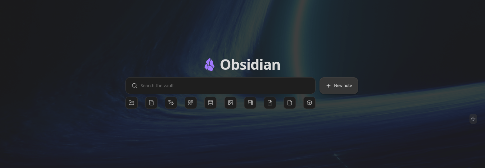

# Hearth

[](https://github.com/ondreu/Hearth/actions/workflows/ci.yml)
[](https://github.com/ondreu/Hearth/releases/latest)
[](https://obsidian.md/plugins?id=hearth)
[](LICENSE)



A beautiful, customizable **home screen for Obsidian** — search, dashboard, and
launcher in one. Hearth turns your vault into a welcoming front page with a fast
fuzzy search, quick file-type filters, and a fully arrangeable grid of live
cards: embeds, web pages, tasks, calendars, stats, clocks, launchpads and more.

## Screenshots


---

## Table of contents

- [Quick start](#quick-start)
- [Search & filters](#search--filters)
- [Dashboard cards](#dashboard-cards)
- [Multiple dashboards](#multiple-dashboards)
- [Arranging the dashboard](#arranging-the-dashboard)
- [Appearance](#appearance)
- [Mobile](#mobile)
- [Settings](#settings)
- [Keyboard shortcuts](#keyboard-shortcuts)
- [Development](#development)
- [Contributing](#contributing)
- [Support](#support)
- [Roadmap](#roadmap)
- [License](#license)

## Quick start

1. Install Hearth from Obsidian's community plugin browser (or drop
   `main.js`, `manifest.json` and `styles.css` into
   `<vault>/.obsidian/plugins/hearth/` and enable it).
2. Hearth opens automatically on startup and replaces empty new tabs — both
   toggleable in **Settings → Hearth**.
3. Open it any time from the ribbon **home** icon or the
   **“Open home dashboard”** command.
4. Hit **Arrange** (top-right) to add, move, resize and configure cards
   directly on the board.

## Search & filters

The search field at the top is your vault's command centre — keyboard-first,
with three transparent modes:

| Prefix | Mode | What it matches |
| --- | --- | --- |
| *(none)* | Fuzzy search | File names, tags, properties, and (optionally) note bodies |
| `#` | Tag search | Vault tags, showing which tag matched |
| `key:value` or `key:` | Frontmatter search | Notes whose property matches |
| `>` | Command mode | Any registered command, run by name |

- **Full-text** matching is on by default — plain queries also match note
  *bodies* and show a snippet of what matched. Matched characters are
  highlighted throughout.
- **Recent files** — a focused, empty search field quietly offers your
  recently opened files.
- **Auto-detected filters** — file-type chips generated from what actually
  lives in your vault (Notes, Images, Videos, Sheets, Slides, Documents,
  Folders, Canvas, Bases, Excalidraw…), each with a fitting icon. Click a
  filter to drop down its matching items; hide any you don't want in settings.
- **New note button** — creates a note in your configured default location.
- **Omnisearch engine** *(optional)* — the search bar uses Hearth's built-in
  engine by default, but you can switch it to
  [Omnisearch](https://github.com/scambier/obsidian-omnisearch) in
  **Settings → Appearance → Search engine**. When selected, plain queries are
  routed through the installed Omnisearch plugin (its results, ranking and
  snippets), while `>` command mode and the file-type filters keep working. If
  Omnisearch isn't installed or enabled, Hearth prompts you to install it and
  stays on the built-in engine.

## Dashboard cards

Cards are the building blocks of the dashboard. Add them from the **Arrange**
toolbar; configure each one from the card itself (title, content, colors, size).

- **Embed** — embed a note (`.md`), image, canvas, or `.base` file, rendered
  through Obsidian's own renderer. A per-card **zoom** control scales content to
  fit. Markdown notes can be made **editable** — rendered by default, switch to a
  raw editor on double-click, saving straight back to the vault. Give a card a
  **second view** (a second file to embed, with its own zoom and editable
  options) and it grows a **switcher** to flip between the two — shown in the
  card **header** when the card has a title, or as a **floating, hover-only**
  control in the top-right corner when it's untitled (headerless). Embedding a
  `.base` file? A **Hide base header** toggle strips the Bases view's own
  toolbar (view switcher + filter/property controls) so the card shows only the
  results.
- **Excalidraw & canvas** — dedicated templates for an Excalidraw drawing or a
  `.canvas` file, filling the card edge-to-edge so native pan/zoom (and
  Excalidraw's in-place edit toggle) work like they do in a regular note.
  Includes a friendly prompt when the required plugin isn't enabled.
- **Daily note** — always shows *today's* daily note (resolved from the core
  Daily notes plugin's date format and folder), with a one-click prompt to
  create it when missing and a hideable button to open it in the editor.
  Optionally editable in place.
- **Web page** — embed any `http(s)` URL in a sandboxed iframe, with an
  optional auto-refresh interval and an "open in browser" fallback for sites
  that refuse to be framed.
- **Tasks** — scans Markdown checkboxes (with 📅 due-date parsing,
  click-to-toggle, click-to-open at the line), reads TaskNotes task notes via
  frontmatter, or reads a [Kanban](https://github.com/obsidian-community/obsidian-kanban)
  plugin board note. Folder whitelist/blacklist for scope. Click **+** (top-right,
  TaskNotes source) to create a new task via TaskNotes' own command. Tasks are
  sorted by **due → scheduled → priority → created**, with a minimalistic
  **sort control** — pick **Smart** (that default chain), **Due date**,
  **Priority**, **Date created** or **Alphabetical**, and optionally **reverse**
  it. A list has one control in its header; a Kanban board puts one **on each
  column** so every column sorts independently. The choice is remembered, and
  incomplete tasks always sort ahead of completed ones. For finer control, the
  list sort control also offers **Custom sort…** — a modal to build an ordered
  list of **rules** (each a field + direction) applied in sequence, so the first
  rule is the primary sort and each next one breaks ties (e.g. *Priority
  descending, then Due date ascending*). Fields include due date, scheduled
  date, priority, date created, alphabetical and status. A custom sort
  supersedes the single-key choice and, on a Kanban board, is the fallback for
  any column without its own override — mirroring how the list **filter** works. Due dates show as short
  relative labels (**Today**, **Tomorrow**, **Yesterday**, the weekday for the
  rest of the week, **Next Friday** / **Last Friday** for the week after, then
  a compact "15 Jul"). They also accept **natural-language input**: write
  `📅 tomorrow`, `📅 next friday`, `📅 in 3 days`, `📅 end of month` (or the same
  wording in a TaskNotes `due` field) and Hearth resolves it to a date. Plain
  checkboxes also read the full **obsidian-tasks marks** — priority
  (🔺⏫🔼🔽⏬), a repeat (🔁), and the start/scheduled/due/done dates — showing
  them as indicators and letting you edit them (right-click a checkbox → **Edit
  dates & priority**, in either the list or the Kanban board). This is a
  per-card **Dates & priorities** toggle (on by default, the same switch the
  Kanban source has); turn it off to read checkboxes as plain text, leaving any
  emoji untouched in the visible text. Empty checkboxes (`- [ ]`) are ignored.
- **Recurring tasks** — TaskNotes tasks with a `recurrence` RRULE show a **↻**
  badge next to the next-occurrence date (read from `scheduled`), tinted with
  the accent color so recurring items stand out at a glance. Hovering the date
  reveals a plain-English schedule (e.g. "Repeats every week"). Overdue
  recurring tasks are tinted just like one-offs.
- **Kanban tasks** — the Tasks card can render as a Kanban board grouped by
  status. Drag cards between columns to change checkbox state or TaskNotes
  status, drag column headers to reorder, and hide columns you don't need.
  TaskNotes tasks show a **priority indicator** read from a configurable
  frontmatter field, and a drop outline previews where a dragged card will
  land. For the **Markdown-checkbox** source you can define your own **task
  states** — one per line as `[symbol] Label` (add `(done)` to mark a state
  complete), e.g. `[ ] To do`, `[/] In progress`, `[x] Done (done)` — and each
  becomes a board column; dragging a card writes that checkbox symbol. A default
  set (To do / In progress / Done) is used until you customise it.
- **Kanban plugin board** — point the Tasks card at a
  [Kanban](https://github.com/obsidian-community/obsidian-kanban) board note
  (or let Hearth auto-detect one by its `kanban-plugin` frontmatter). Each `##`
  heading becomes a column and the checkbox items beneath it become cards.
  Read it either as a **list** or as Hearth's own **Kanban board**: drag cards
  between the board's real columns (Hearth rewrites the note, moving the item
  under the target heading), tick a card to complete it in place, and add new
  cards straight into a column. Card text renders **`[[wikilinks]]` and
  Markdown links** as clickable links, and a card can carry a plain-text
  **description** shown as sub-bullets. **Double-click a column title** to
  rename it. **Right-click a card** (on the board or in the list) to **edit its
  dates & priority**, **convert it into its own note** (like the Kanban plugin
  — the card becomes a link), or **delete** it. Convert-to-note moves the
  card's **description into the new note** (as bullet points), can **seed the
  note from a template** (with `{{title}}`/`{{date}}`/`{{time}}` substitution),
  and can optionally **scrape the card's metadata into the note's frontmatter**
  instead of leaving the emoji markers on the board link — all set per card in
  its settings. Prefer notes over checkboxes? Turn on **New tasks as notes** and
  every card you add is created as its own note (a link on the board) straight
  away, applying the same template and metadata options. The **add-card form**
  also carries a per-add **Create as note** toggle, and when a template is set it
  **previews the template body** right in the form so you can edit it before the
  note is created. A converted card keeps
  showing its dates & priority on the board (read back from the linked note's
  frontmatter), and both its metadata and **description stay editable straight
  from the card** — the quick view writes the metadata to the note's frontmatter
  and the description to the note body. A column's **check icon** marks
  it a *done column*, so cards complete automatically when dragged or added
  there (and the ones already in it complete at once). Turn on **Dates &
  priorities** to read the marks each card carries (compatible with
  [obsidian-tasks](https://github.com/obsidian-tasks-group/obsidian-tasks)):
  a five-level priority (🔺⏫🔼🔽⏬, each a distinct colour), a repeat (🔁), and
  the start (🛫), scheduled (⏳), due (📅) and done (✅) dates — shown as compact
  indicators (priority as a coloured dot on board cards, a labelled chip in the
  list) and used for sorting. The **add-card form** and the right-click
  **Edit dates & priority** dialog both provide fields: a priority menu, a
  deterministic repeat picker (daily/weekly/monthly/yearly × an interval),
  start/scheduled/due date pickers, and a description — where a repeat is
  mutually exclusive with fixed start/due dates (a recurring card is anchored by
  its scheduled date). Checking a one-off card off stamps its ✅ done date
  (unchecking removes it). A **recurring** card (one with a 🔁) completes
  **per-occurrence** instead — like TaskNotes: checking it stamps today's ✅ and
  rolls its date to the next occurrence, so it reads as done today and resets to
  open on its next date rather than retiring. The list layout gains a
  minimalistic header with the task count
  and a quick-add. Leave the mode off to read the board as plain text.
  Everything is written back in Kanban's own format, so the board stays fully
  editable in the Kanban plugin.
- **Task quick view** — clicking a checkbox task or Kanban card opens a compact
  popover with its metadata and description, editable in place, plus buttons to
  **open the full note** or **delete the task** — instead of jumping straight
  into the note. It's a per-card **Quick view on click** toggle (on by default);
  turn it off to open the note on click. (TaskNotes tasks always open in their
  own editor.)
- **Mini calendar** — a month grid resolved from the core Daily notes plugin's
  format/folder, with a dot on days that already have a note. Optional ISO week
  numbers and an edit-count heatmap tint; click an empty day to create that
  day's note.
- **Vault statistics** — notes, attachments, folders, unique tags and your
  daily-note streak, read entirely from the in-memory vault index.
- **Saved search** — runs a stored query (the same syntax as the search bar) and
  lists the matching files, refreshed live.
- **Activity heatmap** — a GitHub-style contribution grid tinted by how many
  notes were edited (or created) each day.
- **Bookmarks** — pulls from Obsidian's core Bookmarks plugin, with site
  favicons next to URL bookmarks.
- **Favorites** — a grid of curated note cards.
- **Recent files** — your recently opened files (configurable count).
- **Links / launchpad** — a grid of tiles opening notes, URLs or commands.
  Tiles live on a **CSS grid** with independent **column and row spans**, so a
  tile can be 2×2, 4×1, or any proportion. In arrange mode, drag a tile to
  **drop it anywhere** on the card — it pins to that spot instead of being
  forced into a top-to-bottom, left-to-right flow (double-click a pinned tile
  to release it back to auto-flow), and resize each tile independently via a
  corner grip.
- **Commands** — tiles that run any command-palette command, on the same grid
  with adjustable per-tile size.
- **Clock & greeting** — digital or **analogue** face, several date formats
  (including a custom moment.js format), and a live greeting with an optional
  **playful** (cheeky, randomised) mode.
- **Text / jot-down** — a quick scratch field saved with the card, rendered as
  Markdown (double-click to edit).
- **Calculator** — a Wolfram-Alpha-style input box that evaluates as you type:
  arithmetic and math functions (`sqrt`, `sin`, `log`, `5!`, `2^10`…), **unit
  conversions** across length, mass, temperature, time, volume, area, speed and
  data (`10 km to miles`, `100 f in c`, `1 gb to mb`), **currency** conversions
  using live ECB rates (`10 € to USD`, `$5 in czk`), and **plain-language**
  queries (`20% of 150`, `5 squared`, `3 x 4`). An optional on-screen **keypad**
  (basic or scientific, chosen in card settings) is handy on mobile. Everything
  except currency is computed locally; exchange rates are fetched once and
  cached, and currency degrades gracefully offline.
- **Dataview query** *(requires the [Dataview](https://github.com/blacksmithgu/obsidian-dataview)
  plugin)* — a card that runs a Dataview query and renders the results through
  Dataview's own renderers, so tables, lists and task lists look exactly as they
  do inside a note and refresh live as the vault changes. The card only appears
  in the **Add card** menu when Dataview is installed and enabled. Paste a
  **DQL** query (`TABLE` / `LIST` / `TASK`) in the card's settings — the same
  text you'd put in a ```` ```dataview ```` block — or switch the query type to
  **DataviewJS** for a ```` ```dataviewjs ```` script (`dv` API in scope; runs
  arbitrary JavaScript, so only use code you trust). Links in the results are
  clickable. **Table** results auto-fit their columns to content and scroll
  horizontally when wider than the card; drag a column header's right edge to
  set a manual width (remembered per card, and re-applied when Dataview
  refreshes). The card runs with no "current note", so global queries (e.g.
  `FROM #tag`) work fully; a query relying on `this.file` has no file to resolve
  to on the dashboard.
- **Plugin view** *(beta)* — host another plugin's — or a core — registered
  **side-panel view** (calendar, outline, tag pane, a Kanban board view…)
  right inside a dashboard card. Pick from the views your enabled plugins and
  Obsidian's core panes provide; the card hosts a **detached workspace leaf**,
  so it never shows up in your saved layout or disturbs your other panes, and it
  cleans itself up when the card redraws or the dashboard closes. It honours the
  card's opacity and blur (frosted glass) like every other card, and shows a
  friendly prompt when the chosen view's plugin is disabled. Some views expect a
  real sidebar and may size oddly on a wide card — hence beta.

### Live content

- Embed and daily cards refresh from vault events the moment their file changes
  (created, edited, deleted); editable notes sync without ever losing the
  cursor.
- Web cards can auto-refresh on an interval.
- Data-driven cards (tasks, stats, calendar, search, heatmap) redraw on vault
  and metadata changes.
- Dataview cards refresh through Dataview's own live-updating renderer whenever
  its index changes.

## Multiple dashboards

- **Switcher** — a `[1] [2] [+]` row in the top-left switches between boards and
  adds new ones. Give a board an **emoji/icon** to label its button instead of a
  number. Right-click a button for **dashboard settings** (name, icon,
  overrides) or to **delete** it. Drag the buttons to reorder boards.
- **Per-dashboard overrides** — each board can override the global **content
  width**, **fit-to-page**, **columns**, **row height** and **background**,
  falling back to the defaults when unset.
- **Pinned cards** — pin any card to show it on *every* dashboard, sharing one
  definition and position across boards.

## Arranging the dashboard

- **Free-form drag & resize** — hit **Arrange** (top-right) to move cards (drag
  anywhere) and resize them from **any edge or corner**. Placement is fully
  free-form: cards sit and size anywhere, with **magnetic alignment** — edges
  and centres snap to neighbouring cards and the board, showing guide lines.
- **Edge-merging cards** — when two cards are snapped together (touching edges),
  their shared border drops out and the touching corners sharpen so the pair
  reads as **one continuous tile** — like grouped Android notifications. The
  merge follows the live layout, so it updates as you drag cards together.
- **On-board management** — in arrange mode each card header is editable:
  rename inline, swap the embedded file via a fuzzy picker, or remove the card.
  **Add card** (toolbar) drops in a new card from the library. A **Hide header**
  toggle in the toolbar hides the dashboard header so the full board is visible
  end-to-end while you arrange.
- **Per-card colors & background** — give any card an accent and a background
  tint.
- **Per-card opacity** — a global **Card opacity** slider tints card surfaces
  so the dashboard background shows through without dimming content. Opacity
  cascades: global → per-dashboard → per-card override.
- **Card blur (frosted glass)** — a backdrop blur behind translucent cards, set
  at the same three levels as opacity: a global **Card blur** default
  (Settings → Dashboard), a per-dashboard override, and a per-card slider in the
  card's **Colors** section. It blurs only the dashboard behind the card, leaving
  the card's content sharp. Cards snapped together blur on **one shared layer**,
  so a merged group reads as a single seamless sheet of glass with no seam at
  the join. Frosted-glass cards are the **default look** for fresh installs
  (card opacity 0.50, card blur 7, over a lighter background blur); existing
  vaults keep their settings until a slider is reset (↺).
- **Ambient default background** — out of the box Hearth ships with a soft
  ambient background (low opacity + blur) that sits behind cards without
  competing with content. Replace it with a solid color, a vault image, or an
  image URL — per-board overrides supported.
- **Independent tile sizing** — tiles live on a fine CSS grid (44 px cells,
  4 px snap), each with its own column and row span. Drag the corner grip to
  resize; drag the tile body to **drop it anywhere on the card** (it pins to
  that spot; double-click to release it back to auto-flow). The default tile
  is a 2×2 cell block.
- **Granular card sizing** — numeric width/height per card, plus a configurable
  row height for fine vertical control.
- **Fit to page** — lock the dashboard to one screen (no scroll) or let it
  scroll. Available globally and per-board. On by default for new installs;
  stuck cards are auto-recovered back onto the board on render.
- **Import / export** — back up or share the active board's layout as JSON.

## Appearance

- **Title & logo** — set any title text and an emoji/short logo.
- **Background** — solid color, a vault image, or an image URL, with opacity
  and blur controls. Per-board overrides supported. Ships with an ambient
  default so the dashboard looks good out of the box.
- **Compact spacing** — tighten card padding and the top margin to enlarge the
  usable area.
- **Card opacity** — make card surfaces translucent so the dashboard background
  shows through; content stays fully legible.
- **Card blur (frosted glass)** — blur the dashboard behind translucent cards
  for a frosted-glass look, at global, per-dashboard and per-card levels. On by
  default for fresh installs; merged cards blur as one seamless surface.

## Mobile

- **Mobile mode** — an optional search-only launcher: on phones and tablets the
  dashboard collapses to just the search field (desktop is unaffected).
- **Mobile action bar** — in Mobile mode, the “New note” button moves out from
  beside the search bar into a row of buttons under the search field and
  filters, pinned to the bottom quarter of the screen. Ships with **New note**,
  **New drawing** (Excalidraw), **Record voice** (core Audio recorder) and
  **Open daily note**, but every button can be swapped for any command from the
  same picker used by the Commands card.
- **Keyboard-aware** — when the on-screen keyboard opens, the visible area is
  tracked so nothing hides behind it.

## Settings

Everything lives under **Settings → Hearth**, organised into a **category
ribbon** pinned at the top — click a tab to see just that group's sections
instead of scrolling one long list. Every setting carries a description, and
many fields have a reset (↺) button back to their default.

- **Appearance** — title, logo, background (none/color/image/URL, opacity,
  blur), compact spacing.
- **Search** — search placeholder, full-text search, new-note button, search
  engine (built-in / Omnisearch), file-type filters.
- **Dashboard** — fit to page, columns, row height, max width, card opacity,
  **card blur** (frosted glass).
- **Behaviour** — open on startup, replace empty new tabs, mobile search-only,
  mobile action bar.
- **Integrations** — Tasks / TaskNotes frontmatter field names and the status
  value(s) that count as "done".
- **Backup** — import / export the current dashboard's layout as JSON.
- **About** — links to the GitHub repository and issue tracker, a Ko-fi tip
  button, and the running version.

Per-card settings (type, title, content, colors, opacity, blur, size) are edited
from the card itself in arrange mode — not from the settings tab.

## Keyboard shortcuts

Hearth registers commands you can bind under **Settings → Hotkeys**:

- **Open home dashboard**
- **Switch to dashboard 1…9**
- **Switch to next / previous dashboard**

In the search field: `↑`/`↓` to move, `Enter` to open, `Esc` to dismiss.

## Development

```bash
npm install      # install dependencies
npm run dev      # watch build -> main.js
npm run build    # typecheck + production build
npm run typecheck
```

To test in a vault, symlink or copy `main.js`, `manifest.json` and `styles.css`
into `<vault>/.obsidian/plugins/hearth/`.

### Translations

User-facing strings live in [`src/locales/`](src/locales/). English
(`en.ts`) is the source of truth and Hearth follows Obsidian's UI language at
load. Adding a language is a matter of copying `en.ts`, translating the values
(the keys are type-checked against English), and registering the file — see
[`src/locales/README.md`](src/locales/README.md) for the walkthrough.

## Contributing

Hearth is moving fast, so right now the most valuable contributions are **bug
reports**, **feature ideas** and **translations** rather than large pull
requests — a big PR against a fast-moving codebase tends to go stale or collide
with work in flight. Small, obvious fixes are always welcome; for anything
larger, please open an issue first. As development slows down I'll be able to
take PRs far more readily. See [CONTRIBUTING.md](CONTRIBUTING.md) for the full
story.

## Support

Hearth is free and open source. If it's earned a place on your vault's front
page and you'd like to support its development, you can buy me a coffee — it's
genuinely appreciated and helps keep the updates coming.

[](https://ko-fi.com/B7K822EW68)

## Shipped:

> **v1.8.0** — a cards-and-appearance release aggregating the whole 1.7.1 beta
> series. Two new cards headline it: a **Dataview card** that runs a DQL or
> DataviewJS query and renders the results through
> **[Dataview](https://github.com/blacksmithgu/obsidian-dataview)**'s own
> renderers (tables, lists and task lists look native and refresh live, with
> auto-fitting, drag-resizable table columns), and a beta **Plugin view card**
> that hosts any plugin's — or a core — **side-panel view** (calendar, outline,
> tag pane, kanban…) right on the dashboard via a detached workspace leaf that
> never touches your saved layout. Cards gain **frosted glass** — a backdrop
> blur behind translucent cards at global, per-dashboard and per-card levels,
> drawn on one shared layer so merged cards read as a single seamless sheet —
> and it's now the **default look** for fresh installs. The **settings tab is
> reorganized** into a category ribbon (Appearance · Search · Dashboard ·
> Behaviour · Integrations · Backup · About) with a description on every setting
> and a new **About** tab. Embed cards can carry a **second view** with a
> switcher and **hide a base's header**, embed **zoom now reflows** to fit its
> card, and the Tasks card grows a **list filter**, a **custom multi-rule sort**,
> and multi-value **TaskNotes "complete" statuses**.

> **v1.7.0** — a major Tasks-card release, plus search and release-notes
> additions (everything from the 1.6.8 beta series). The Tasks card can now read
> and edit **[Kanban](https://github.com/obsidian-community/obsidian-kanban)
> plugin boards** — each heading a column, each checkbox a card — as a list or a
> drag-and-drop board that rewrites the note in Kanban's own format. Cards
> understand the full **obsidian-tasks metadata**: start (🛫), scheduled (⏳),
> due (📅) and done (✅) dates, a 5-level priority (🔺⏫🔼🔽⏬, each a distinct
> colour) and recurrence (🔁), shown as compact indicators with a right-click
> editor and add-card pickers — read from Kanban cards and plain **Markdown
> checkboxes** alike, and you can define your own **custom task states**
> (`[symbol] Label`) that each become a draggable board column. Clicking a task
> opens a compact **quick view** for editing metadata and description in place;
> **convert to note** turns a card into its own linked note (optionally from a
> template, scraping metadata into frontmatter and moving the description into
> the note), or new cards can be **created as notes** outright. Boards gain
> **done columns**, double-click **column rename**, clickable links, per-card
> descriptions, card deletion, an always-visible **sort** control (Smart / Due /
> Priority / Created / Alphabetical) that lives on each column, and recurring
> tasks that complete **per-occurrence** like TaskNotes. The search bar can
> optionally be powered by
> **[Omnisearch](https://github.com/scambier/obsidian-omnisearch)** when it's
> installed, scroll-mode boards grow as you drag a card past the bottom, and a
> **"What's new" dialog** now surfaces release notes from a continuous,
> accumulating changelog after each update.

> **v1.6** — task due dates show as short relative labels ("Today", "Tomorrow",
> "Yesterday", "Friday", "Next Friday", "15 Jul"), free-form launchpad tiles
> you can drop anywhere on the card (not just the top-to-bottom flow), centred
> mobile search, and edge-merging cards: two cards snapped together lose their
> shared border and sharpen their touching corners so they read as one
> continuous tile. Task due dates also accept natural-language input (`📅
> tomorrow`, `📅 next friday`, `📅 in 3 days`…). Launchpad tiles are now pure
> free-form: they can be placed anywhere and may overlap — a hidden tile glows
> so the overlap is easy to spot and fix. An optional **Auto-shift tiles**
> (beta) per-card toggle makes tiles shove each other aside live while
> dragging (phone-widget style). In arrange mode the per-card headers can be
> toggled off so each card's full body is visible.

> **v1.5** — a redesigned dashboard experience: a CSS-grid tile layout with
> independent column/row spans and drag-to-reorder, an ambient default
> background, an overhauled starter dashboard, recurring TaskNotes tasks with
> a ↻ badge and human-readable recurrence tooltip, smarter task sorting
> (due → scheduled → priority → created), kanban drop outlines, calendar
> today outline under the heatmap, search layout polish, and many fit-to-page
> and card-drag fixes.

## License

MIT © ondreu
